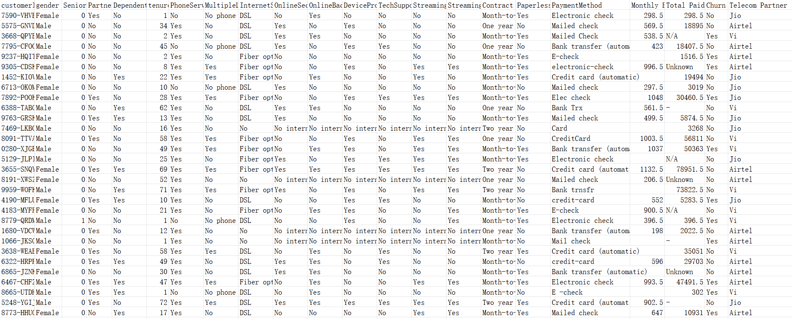
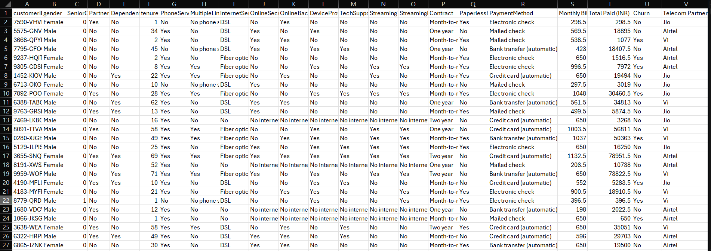
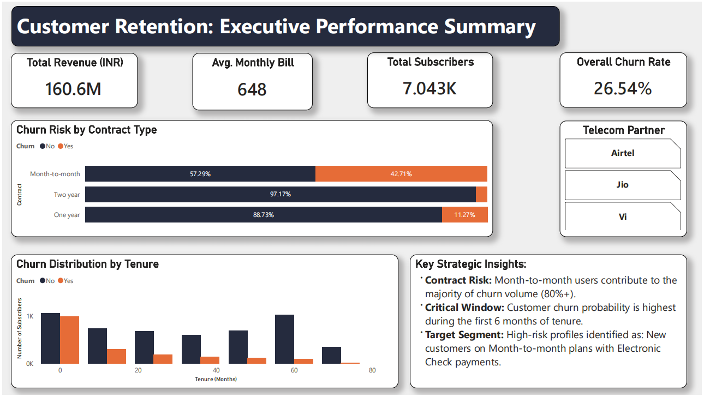
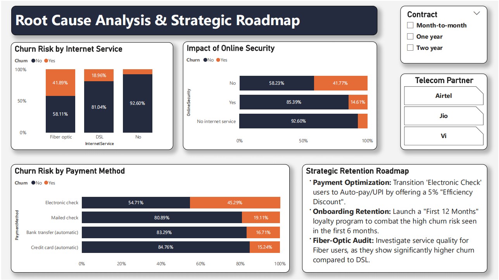

# 📊 Telecom Customer Retention Analysis

## 🎯 Project Objective
This project focuses on analyzing customer churn for a leading telecom provider. By leveraging Power BI, I identified high-risk segments and developed a data-driven strategic roadmap to reduce churn and improve customer lifetime value.

## 🛠️ Data Transformation (Before vs After)
To ensure accuracy, the raw data underwent a rigorous cleaning process in Excel before being modeled in Power BI.

### ❌ Before: Raw & Messy Data

*Issues: Inconsistent formatting, messy headers, and unorganized records.*

### ✅ After: Cleaned & Structured Data

*Actions: Removed duplicates, handled null values, standardized data types, and prepared for DAX modeling.*

---

## 🖼️ Dashboard Previews (Final Result)

### Page 1: Executive Performance Summary

### Page 2: Root Cause Analysis & Strategic Roadmap

## 🚀 Key Insights
*   **Contract Risk:** Month-to-month subscribers are the primary churn drivers, contributing to **80%+** of total churn volume.
*   **Critical Retention Window:** Customer churn probability is highest during the **first 6 months** of tenure.
*   **High-Risk Segment:** Users with **Electronic Check** payments and **Fiber Optic** services show significantly higher churn rates compared to other segments.

## 🛠️ Strategic Roadmap (Recommendations)
1.  **Payment Optimization:** Incentivize the transition of 'Electronic Check' users to Auto-pay or UPI by offering a 5% "Efficiency Discount."
2.  **Onboarding Focus:** Launch a targeted "First 12 Months" loyalty program to bridge the early tenure churn gap.
3.  **Service Quality Audit:** Recommend a technical service audit for Fiber-Optic customers in high-churn clusters to address potential service dissatisfaction.

---

## 💻 Tech Stack
*   **Microsoft Excel:** Data cleaning, initial exploratory data analysis (EDA), and data validation.
*   **Power BI Desktop:** Advanced data modeling (Star Schema), interactive visualization, and dashboard design.
*   **Analytics & DAX:** Used Data Analysis Expressions (DAX) for custom KPIs and Root Cause Analysis (RCA).
